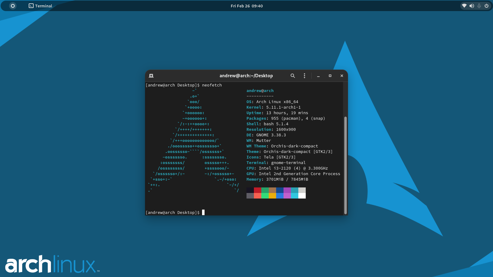

# Arch Linux Simple Rice

## This is Arch Linux Simple Rice on Gnome Desktop
DISCLAIMER : This is not my final rice, if you have some recommendation that I can try you can ping me ^_^

# PC Specification

-   Proc : Intel i3-2120
-   RAM : 8GB DDR-3
-   Drive : Seagate HDD 300GB
-   Mouse : Logitech G-403
-   Keyboard : Keychron K6, Squiggle Split

# Icon Theme

After searching for a while, finally I got this beautiful icon theme

https://github.com/vinceliuice/Tela-icon-theme

# Theme

Theme that I used is Orchis Theme

https://github.com/vinceliuice/Orchis-theme

